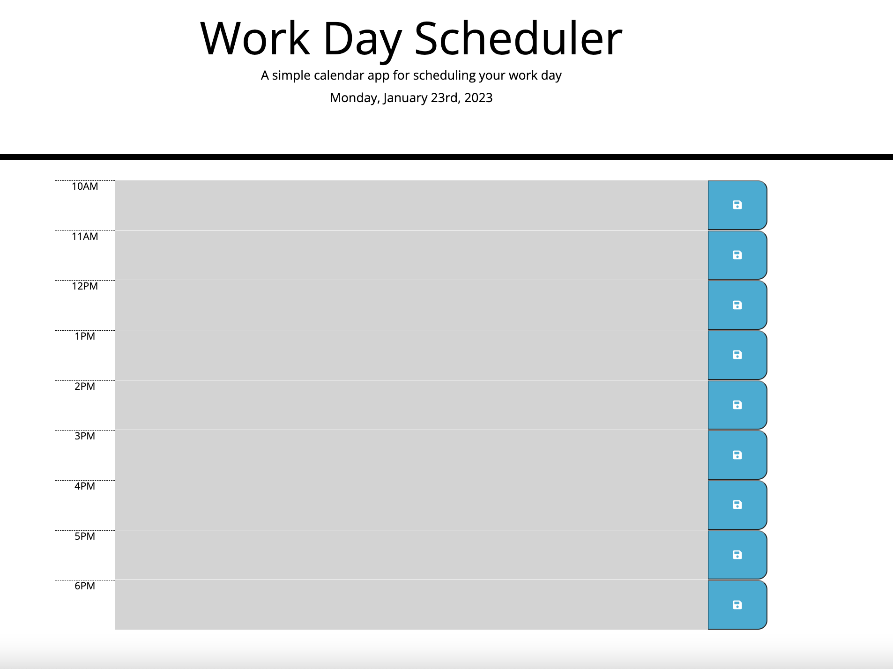

# Work-Day-Scheduler

## Description
This webpage features a simple day planner for the average work hours of 10AM - 6PM. The developer was provided with the CSS styling as well as a basic outline of HTML content and utilizes javascript and the Moment API to provide a dynamic color display according to the user's current time.

<!-- PROJECT -->
 

 
The user can access all the Day Planner features at the

  <a href="https://pixelfobia.github.io/Work-Day-Scheduler/">
		
Visit the Github Page ->

  </a>

## Usage
The user will be presented a series of text boxes which relate to the hour of the work day. The user can edit in any messages or notes into these spaces. Upon hitting any of the save buttons on the right side, the text in that corresponding space will be saved to local storage and will be visible in that space until manually deleted or edited over.

## Credits

This webpage was created while enrolled at the Frontend Developer Bootcamp in edX.

## License

The last section of a high-quality README file is the license. This lets other developers know what they can and cannot do with your project. If you need help choosing a license, refer to [https://choosealicense.com/](https://choosealicense.com/).

---

